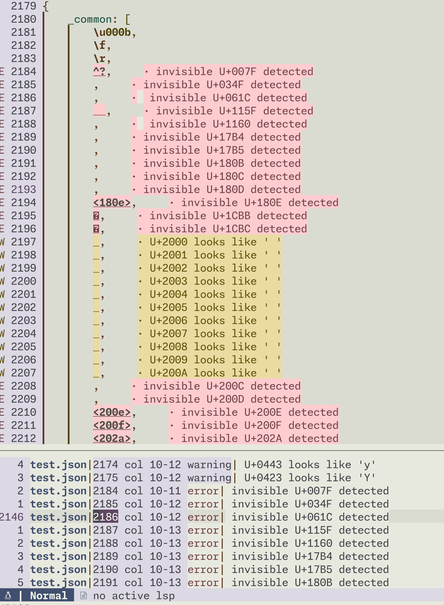

# unicode-highlight.nvim

A Neovim plugin that highlights ambiguous and invisible Unicode characters, similar to VS Code's Unicode highlighting feature. Detect potentially problematic Unicode characters that could be mistaken for regular ASCII characters or are completely invisible.



##  Features

-  **Ambiguous Character Detection**: Highlights Unicode characters that visually resemble ASCII characters (e.g., Greek Ο vs Latin O)
-  **Invisible Character Detection**: Detects zero-width spaces, non-breaking spaces, and other invisible Unicode characters
-  **Multiple Display Methods**:
  - Syntax highlighting with customizable colors
  - Virtual text annotations showing character codes
  - Diagnostic messages (errors/warnings)
  - Quickfix list integration
-  **Real-time Updates**: Automatically scans buffer on text changes with debouncing
-  **Flexible Configuration**: Customize colors, file types, and behavior

##  Installation

### Using [lazy.nvim](https://github.com/folke/lazy.nvim)

```lua
return {
  "racakenon/unicode-highlight.nvim",
}
```

##  Configuration

### Default Configuration

```lua
require("unicode-highlight").setup({
  highlight_ambiguous = true,           -- Highlight ambiguous Unicode characters
  highlight_invisible = true,           -- Highlight invisible Unicode characters
  ambiguous_hl = "@comment.warning",    -- Highlight group for ambiguous characters
  invisible_hl = "@comment.error",      -- Highlight group for invisible characters
  auto_enable = true,                   -- Automatically enable on startup
  filetypes = {},                       -- Empty = all filetypes (whitelist)
  excluded_filetypes = {                -- Blacklist of filetypes
    "help", "qf", "terminal"
  },
  debounce_ms = 35,                     -- Debounce time for text changes
  virtual_text_prefix = "·",           -- Prefix for virtual text
})
```

### Highlight Groups

The plugin uses tree-sitter highlight groups by default:
- `@comment.warning` - Yellow/orange highlight for ambiguous characters
- `@comment.error` - Red/pink highlight for invisible characters

You can customize these to any highlight group:

```lua
require("unicode-highlight").setup({
  ambiguous_hl = "WarningMsg",
  invisible_hl = "ErrorMsg",
})
```

##  Commands

| Command | Description |
|---------|-------------|
| `:UnicodeHighlightEnable` | Enable highlighting for the current buffer |
| `:UnicodeHighlightDisable` | Disable highlighting for the current buffer |
| `:UnicodeHighlightToggle` | Toggle ambiguous/invisible scanning |
| `:UnicodeHighlightQF` | Send all detected characters to quickfix and open it |
| `:UnicodeHighlightVTextToggle` | Toggle virtual text display |

##  Usage Examples

### Basic Usage

Once installed, the plugin automatically scans your buffers for problematic Unicode characters:

- **Ambiguous characters** appear with a warning highlight and show messages like `U+2000 looks like ' '`
- **Invisible characters** appear with an error highlight and show messages like `invisible U+007F detected`

### Working with Quickfix

To review all problematic characters in your file:

```vim
:UnicodeHighlightQF
```

This opens the quickfix window with all detected characters, allowing you to jump to each occurrence.

### Temporarily Disable

If you're working with files that intentionally use Unicode characters:

```vim
:UnicodeHighlightDisable
```

### File Type Specific Configuration

Only enable for specific file types:

```lua
require("unicode-highlight").setup({
  filetypes = { "javascript", "typescript", "python", "lua" },
})
```

Or exclude certain file types:

```lua
require("unicode-highlight").setup({
  excluded_filetypes = { "markdown", "text", "help" },
})
```

##  Detected Characters

This plugin detects Unicode characters based on data from [vscode-unicode-data](https://github.com/hediet/vscode-unicode-data). The character sets include:

### Ambiguous Characters
Characters that visually resemble ASCII characters but have different Unicode code points:
- Homoglyphs (e.g., Cyrillic о U+043E vs Latin o U+006F)
- Mathematical symbols resembling letters
- Full-width characters

### Invisible Characters
Characters with no visible representation:
- Zero-width spaces (U+200B, U+200C, U+200D)
- Various control characters
- Non-breaking spaces
- Soft hyphens

##  Requirements

- Neovim 0.10+ (uses diagnostic user_data and modern APIs)

## Acknowledgments

- Character data sourced from [hediet/vscode-unicode-data](https://github.com/hediet/vscode-unicode-data)
